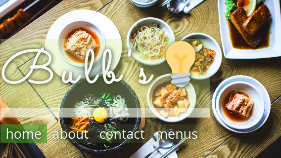

# [Bulb's - A Sample Restaurant Page](https://clavierbulb-green.github.io/Bulb-s-Restaurant-Page/)

---
A dynamically rendered home page for a fictitious restaurant. Written to practice
DOM manipulation and ES6 modules in Javascript, and responsive design in CSS.

Written as a solution to [Project:Restaurant Page](https://www.theodinproject.com/courses/javascript/lessons/restaurant-page) by the [Odin Project](https://www.theodinproject.com/home).

---
## TODO
+ [ ] Replace lorem pisum text with 'real', unique content for each tab
+ [ ] Import tab modules dynamically
+ [ ] Refactor, modularize code

---
## Reference
+ [for...of - JavaScript | MDN](https://developer.mozilla.org/en-US/docs/Web/JavaScript/Reference/Statements/for...of)
+ [import - JavaScript | MDN](https://developer.mozilla.org/en-US/docs/Web/JavaScript/Reference/Statements/import)
+ [Remove all child elements of a DOM node in JavaScript - Stack Overflow](https://stackoverflow.com/questions/3955229/remove-all-child-elements-of-a-dom-node-in-javascript)
